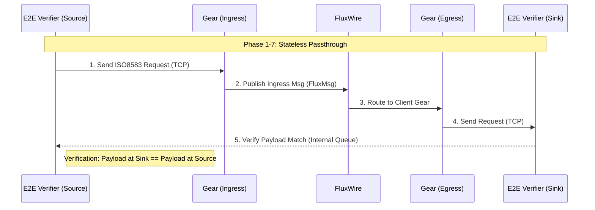
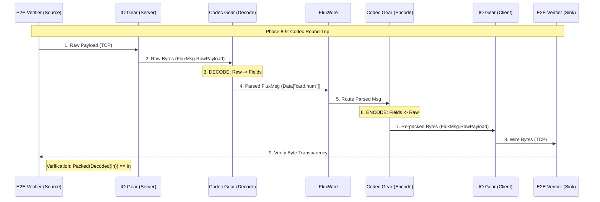

# ISO8583 I/O Gear E2E Test Suite

This suite provides comprehensive validation for the `io_iso8583` gear, covering various industry dialects, framing formats, and encoding standards. It uses a combination of static replay (PCAP) and dynamic traffic generation to ensure robust handling of real-world payment scenarios.

## 🧪 Test Matrix
The regression suite (`run.sh`) executes a **7-phase validation matrix**, where every phase verifies **both Server (Ingress) and Client (Egress)** capabilities using an integrated "Gateway Loopback" topology.

| Phase | Description | Goal |
|-------|-------------|------|
| **1** | **Dynamic ASCII-BE** | Verify **ASCII / Big Endian** using **Dynamic E2E Verification** (Script -> Gateway -> Script). |
| **2** | **Mismatch Check** | Verify rejection of Mismatched framing (LE vs BE). **Method: Static PCAP Injection**. |
| **3** | **Dynamic ASCII-LE** | Verify **ASCII / Little Endian** Loopback. Includes **Static PCAP Injection** validation. |
| **4** | **Dynamic BCD-BE** | Verify **BCD / Big Endian** using **Dynamic E2E Verification**. |
| **5** | **Mismatch Check** | Verify rejection of Mismatched BCD traffic. **Method: Static PCAP Injection**. |
| **6** | **Dynamic BCD-LE** | Verify **BCD / Little Endian** Loopback. Includes **Static PCAP Injection** validation. |
| **7** | **Visa V.I.P** | Verify Visa Header parsing + EBCDIC encoding. **Method: Dynamic E2E Verification**. |
| **8** | **Codec Round-Trip** | Verify **Byte Transparency**. Decodes and re-encodes payloads to ensure 100% byte fidelity. |
| **9** | **Trace Logging** | Verify **Observability**. Checks that trace logs are emitted with correct metadata (flux_id, MTI). |

### Integrated Gateway Topology
In this architecture, FluxRig acts as a Gateway, receiving traffic on one port and relaying it to an upstream host (Mock Server).

#### Basic Topology (I/O Only)
Used for stateless routing or load balancing.



#### Codec-in-the-Loop Topology
Used for protocol validation and field-level logic. This setup proves **Byte Transparency** through the full decode/encode cycle.



## �️ Resilience & Reliability

The suite validates critical resilience features required for production stability.

### 1. Byte Transparency (Phases 1-8)
**Goal**: Ensure legacy systems can be proxied without data loss.
- **Verification**: The suite performs a full decode → encode round-trip.
- **Check**: Validates that the output bytes match the input bytes exactly, ensuring no loss of proprietary fields, leading/trailing padding, or encoding nuances.

### 2. Connection Recovery (Phase 5 Logic)
**Goal**: Survive network instability.
- **Server**: Verified that `Accept()` loops handle transient errors (backoff) without crashing the process.
- **Client**: Verified that `Dial()` logic waits (`reconnect_wait`) before retrying, preventing "thundering herd" or spin loops against down peers.

### 3. Trace Logging (Phase 9)
**Goal**: Debuggability without Security Compromise.
- **Verification**: Confirms structured logs are emitted for every transaction.
- **Check**: Validates presence of `flux_id`, `mti`, and field lists. NOTE: Production configs must audit trace levels to prevent PAN leakage.

## ⚙️ Configuration Reference

Tune these values in `deployment.yaml` or `scenario.yaml` to match network conditions:

| Parameter | Default | Description |
|:---|:---|:---|
| `connect_timeout` | `10s` | Max time to wait for TCP handshake. |
| `read_timeout` | `30s` | Max time to wait for a full frame (DoS protection). |
| `write_timeout` | `5s` | Max time to send a frame. |
| `reconnect_wait` | `5s` | Time to wait after disconnect before redialing. |
| `idle_timeout` | `60s` | Close connection if no traffic (Resource cleanup). |

## �📂 Test Vectors (PCAP)

The `samples/` directory contains reference captures used for static injection and dynamic generation templates.
**Source**: [Wireshark Wiki - SampleCaptures](https://wiki.wireshark.org/SampleCaptures#iso-8583-1)

| File | Origin / Type | Content Description |
|------|---------------|---------------------|
| `iso8583_ascii_sample.pcapng` | **Generic Simulator** | Standard ASCII. 2-byte Little Endian framing. |
| `iso8583_bin_sample.pcapng` | **Legacy POS Terminal** | Packed BCD. 2-byte Little Endian framing. |
| `prod/*.pcap` | **Production Traffic** | Real-world high-volume traffic (BCD/Big Endian) used for heavy load validation. |

## 🛠 Components

| Component | Description |
|-----------|-------------|
| `run.sh` | **Regression Orchestrator**. Manages the 7-phase matrix. Starts Gears and executes E2E verification steps. |
| `iso8583_tool.py` | **E2E Verifier**. Dual-mode script that runs both an Injector and a Mock Server thread to verify end-to-end payload delivery. |
| `sample_injector.py` | **PCAP Replayer**. Extracts TCP payloads using `tshark` and replays them. |

## 📜 Logging & Diagnostics

### Workspace
Tests run in a persistent local workspace (`work/rack/logs`).

**Log Location**: `test/e2e/iso8583/work/rack/logs/rack.log`

### Log Levels
- **INFO**: High-level traffic summary (MTI, Bitmap count, validity).
- **TRACE**: Detailed forensics including:
    - `raw frame read`: Hex Dump of ingress TCP bytes.
    - `Bus Receive`/`Bus Emit`: Hex Dump of internal FluxMsg payload.

## 🚀 Running the Tests

```bash
# Run Full Regression Suite
./run.sh

# Inspect Logs
tail -f work/rack/logs/rack.log
```
