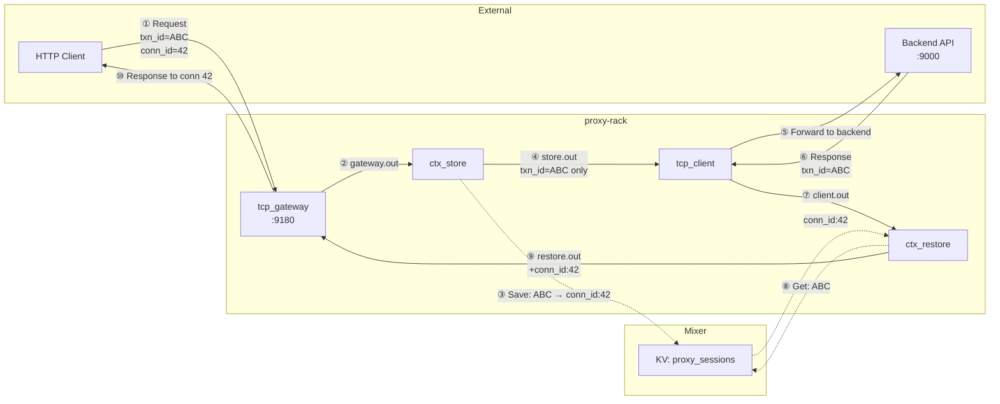
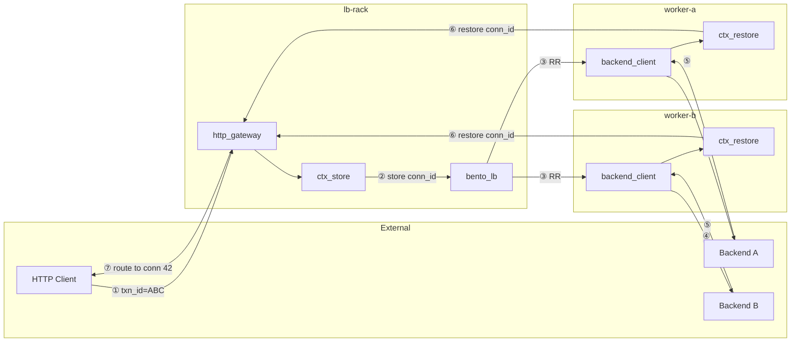
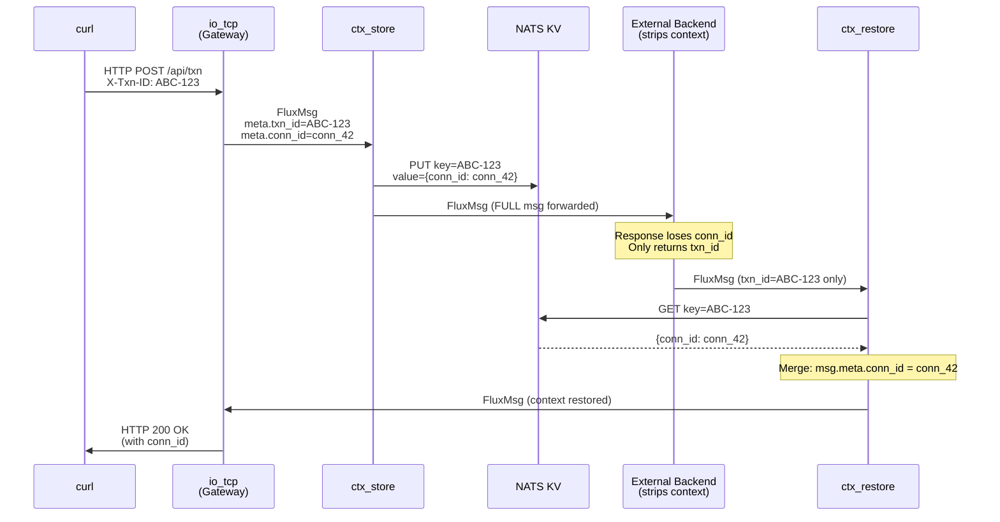
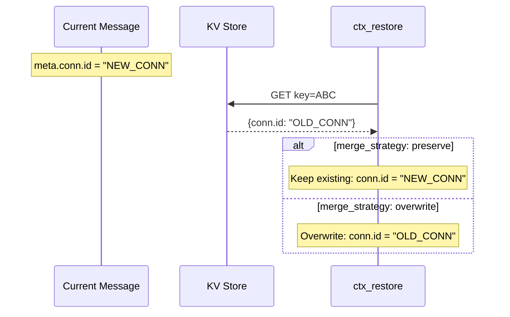

# Coat Check Gear E2E Validation Suite

## Purpose

Comprehensive validation of the **Coat Check** (Context Correlation) gear. This suite validates all modes, configuration options, and edge cases in isolation from protocol-specific gears (e.g., ISO8583).

## Components

| Component | Description |
|-----------|-------------|
| **HTTP Echo Gear** | Simple HTTP gear for traffic generation (non-ISO8583) |
| **ctx_store** | Coat Check in `store` mode |
| **ctx_restore** | Coat Check in `restore` mode |
| **ctx_daemon** | Coat Check in `daemon` mode (Governance) |

## Test Matrix

### 1. Mode Validation

| Test Case | Mode | Description | Expected |
|-----------|------|-------------|----------|
| `TC01_store_basic` | `store` | Store full FluxMsg context | Key created in KV |
| `TC02_restore_basic` | `restore` | Restore context by key | Metadata merged |
| `TC03_daemon_ttl` | `daemon` | Automatic TTL expiration | Key evicted after TTL |

### 2. Parameter Validation

| Test Case | Parameter | Value | Expected |
|-----------|-----------|-------|----------|
| `TC10_value_fields_full` | `value_fields` | `[]` (empty) | Full FluxMsg stored |
| `TC11_value_fields_partial` | `value_fields` | `["meta.conn.id"]` | Only `conn.id` stored |
| `TC12_key_fields_single` | `key_fields` | `["meta.txn_id"]` | Key = `txn_id` value |
| `TC13_key_fields_composite` | `key_fields` | `["meta.src", "meta.seq"]` | Key = `src:seq` (composite) |
| `TC20_on_missing_error` | `on_missing` | `error` | Returns error if key missing |
| `TC21_on_missing_drop` | `on_missing` | `drop` | Silently drops message |
| `TC22_on_missing_forward` | `on_missing` | `forward` | Forwards without context |
| `TC30_merge_preserve` | `merge_strategy` | `preserve` | Existing metadata kept |
| `TC31_merge_overwrite` | `merge_strategy` | `overwrite` | Saved metadata overwrites |

### 3. Cross-Rack Context Sharing

| Test Case | Topology | Description | Expected |
|-----------|----------|-------------|----------|
| `TC40_single_rack` | 1 Rack | Store and Restore on same Rack | Works via local KV |
| `TC41_multi_rack_shared` | 2 Racks | Store on Rack A, Restore on Rack B | Works via shared NATS KV |

### 4. Edge Cases

| Test Case | Scenario | Expected |
|-----------|----------|----------|
| `TC50_key_not_found` | Restore with missing key | Behavior per `on_missing` |
| `TC51_key_collision` | Same key stored twice | Last write wins (or version conflict?) |
| `TC52_binary_key` | Key contains binary data | Key sanitized (Base64) |
| `TC53_large_payload` | Store 1MB payload | Works within NATS limits |
| `TC54_ttl_expiry` | Restore after TTL | Key not found |

## Directory Structure

```
test/e2e/coatcheck/
├── README.md               # This file
├── run_all.sh              # Master test runner
├── scenarios/
│   ├── tc01_store_basic.yaml
│   ├── tc02_restore_basic.yaml
│   ├── tc10_value_fields_full.yaml
│   ├── tc11_value_fields_partial.yaml
│   ├── tc20_on_missing_error.yaml
│   ├── tc21_on_missing_drop.yaml
│   ├── tc22_on_missing_forward.yaml
│   ├── tc30_merge_preserve.yaml
│   ├── tc31_merge_overwrite.yaml
│   ├── tc40_single_rack.yaml
│   └── tc41_multi_rack_shared.yaml
├── mixer/
│   └── fluxrig-mixer.toml
├── rack_a/
│   └── iso_rack.toml
├── rack_b/                 # For multi-rack tests
│   └── iso_rack.toml
└── scripts/
    ├── generate_traffic.sh # Sends HTTP requests to trigger flow
    └── verify_kv.sh        # Inspect NATS KV bucket
```

## Architecture

### Key Concept: HTTP Reverse Proxy with Context Preservation

**Scenario**: fluxrig acts as an HTTP reverse proxy. Internal routing metadata (`conn_id`) must NOT be forwarded to the backend, but is required to route the response back to the correct client connection.

| Metadata | Description | Forwarded to Backend? |
|----------|-------------|----------------------|
| `conn_id` | Internal TCP connection ID (routing) | ❌ No |
| `session_id` | Internal session state | ❌ No |
| `txn_id` | Transaction/Correlation ID | ✅ Yes |

**Flow**:
1. Client sends request with `txn_id` header
2. Gateway assigns internal `conn_id` for response routing
3. `ctx_store` saves `{conn_id, session_id}` keyed by `txn_id`
4. Request forwarded to backend (without internal metadata)
5. Backend response contains `txn_id` but NOT `conn_id`
6. `ctx_restore` retrieves `conn_id` using `txn_id` from response
7. Response routed back to correct client connection

### Single Rack Topology

Based on [tc01_basic.yaml](scenarios/tc01_basic.yaml):

```yaml
wires:
  # Request Path
  - from: "http_gateway.out" → to: "ctx_store.in"
  - from: "ctx_store.out"    → to: "http_client.in"
  # Response Path  
  - from: "http_client.out"  → to: "ctx_restore.in"
  - from: "ctx_restore.out"  → to: "http_gateway.in"
```



### Multi-Rack Topology: Bento Load Balancer

Based on [tc41_multirack_lb.yaml](scenarios/tc41_multirack_lb.yaml):

**Architecture**: LB Rack distributes requests to Worker Racks using Bento round-robin.
All racks share same NATS KV bucket for context correlation.



## Data Flow Sequence

### Store → Restore Flow (Same Rack)



### Merge Strategy: Overwrite vs Preserve



## Traffic Generation

### Method

Traffic is generated using `nc` (Netcat) to send TCP requests to the `io_tcp` gear (acting as a TCP gateway).

### Request Format

```bash
# Single request with transaction ID
curl -X POST http://localhost:8080/api/txn \
  -H "X-Txn-ID: TXN-001" \
  -H "X-Session-ID: SESS-42" \
  -d '{"amount": 100}'

# Batch requests with wrk
wrk -t4 -c10 -d30s -s scripts/traffic.lua http://localhost:8080/api/txn
```

### Metadata Injection

The `io_tcp` gear extracts HTTP headers and injects them as FluxMsg metadata:

1.  **Ingress**: `io_tcp` (Gateway)
    *   Receives HTTP Request.
    *   Extracts `conn.id` (Connection ID).
    *   Emits to `io_tcp.out`.
    *   Emits to `io_tcp.out`.id` |

### Validation Script

```bash
# verify_kv.sh - Inspect stored keys
nats kv ls coatcheck_ctx
nats kv get coatcheck_ctx TXN-001
```

Example flow:
```
HTTP Request (X-Txn-ID: ABC) 
  → io_tcp.in (adds meta.conn.id)
  → ctx_store (stores key=ABC, value={conn.id})
  → Echo Server (reflects message)
  → ctx_restore (retrieves key=ABC, merges conn.id)
  → io_tcp.out (response with context)
```

## Running Tests

```bash
# Run all tests
./test/e2e/coatcheck/run_all.sh

# Run specific test
./test/e2e/coatcheck/run_all.sh TC31_merge_overwrite

# Run multi-rack tests only
./test/e2e/coatcheck/run_all.sh --multi-rack
```

## Success Criteria

- [ ] All 14+ test cases PASS
- [ ] No KV key leaks after TTL
- [ ] Cross-rack context works via shared NATS
- [ ] `merge_strategy: overwrite` correctly replaces metadata
- [ ] `on_missing: drop` silently drops without error
