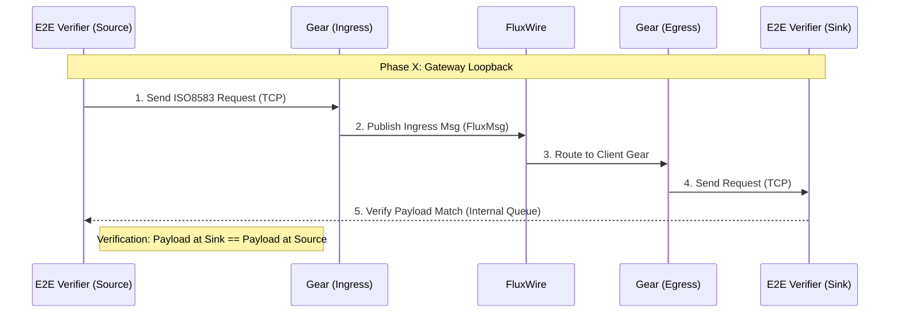

# ISO8583 I/O Gear E2E Test Suite

This suite provides comprehensive validation for the `io_iso8583` gear, covering various industry dialects, framing formats, and encoding standards. It uses a combination of static replay (PCAP) and dynamic traffic generation to ensure robust handling of real-world payment scenarios.

## 🧪 Test Matrix
The regression suite (`run.sh`) executes a **7-phase validation matrix**, where every phase verifies **both Server (Ingress) and Client (Egress)** capabilities using an integrated "Gateway Loopback" topology.

| Phase | Description | Goal |
|-------|-------------|------|
| **1** | **Dynamic ASCII-BE** | Verify **ASCII / Big Endian** using **Dynamic E2E Verification** (Script -> Gateway -> Script). |
| **2** | **Mismatch Check** | Verify rejection of Mismatched framing (LE vs BE). **Method: Static PCAP Injection**. |
| **3** | **Dynamic ASCII-LE** | Verify **ASCII / Little Endian** Loopback. Includes **Static PCAP Injection** validation. |
| **4** | **Dynamic BCD-BE** | Verify **BCD / Big Endian** using **Dynamic E2E Verification**. |
| **5** | **Mismatch Check** | Verify rejection of Mismatched BCD traffic. **Method: Static PCAP Injection**. |
| **6** | **Dynamic BCD-LE** | Verify **BCD / Little Endian** Loopback. Includes **Static PCAP Injection** validation. |
| **7** | **Visa V.I.P** | Verify Visa Header parsing + EBCDIC encoding. **Method: Dynamic E2E Verification**. |

### Integrated Gateway Topology
In this architecture, FluxRig acts as a Gateway, receiving traffic on one port and relaying it to an upstream host (Mock Server). The **E2E Verifier Script** manages both ends of the connection to ensure that what is injected is exactly what is received upstream.



## 📂 Test Vectors (PCAP)

The `samples/` directory contains reference captures used for static injection and dynamic generation templates.
**Source**: [Wireshark Wiki - SampleCaptures](https://wiki.wireshark.org/SampleCaptures#iso-8583-1)

| File | Origin / Type | Content Description |
|------|---------------|---------------------|
| `iso8583_ascii_sample.pcapng` | **Generic Simulator** | Standard ASCII. 2-byte Little Endian framing. |
| `iso8583_bin_sample.pcapng` | **Legacy POS Terminal** | Packed BCD. 2-byte Little Endian framing. |
| `prod/*.pcap` | **Production Traffic** | Real-world high-volume traffic (BCD/Big Endian) used for heavy load validation. |

## 🛠 Components

| Component | Description |
|-----------|-------------|
| `run.sh` | **Regression Orchestrator**. Manages the 7-phase matrix. Starts Gears and executes E2E verification steps. |
| `iso8583_tool.py` | **E2E Verifier**. Dual-mode script that runs both an Injector and a Mock Server thread to verify end-to-end payload delivery. |
| `sample_injector.py` | **PCAP Replayer**. Extracts TCP payloads using `tshark` and replays them. |

## 📜 Logging & Diagnostics

### Workspace
Tests run in a persistent local workspace (`work/rack/logs`).

**Log Location**: `test/e2e/iso8583/work/rack/logs/rack.log`

### Log Levels
- **INFO**: High-level traffic summary (MTI, Bitmap count, validity).
- **TRACE**: Detailed forensics including:
    - `raw frame read`: Hex Dump of ingress TCP bytes.
    - `Bus Receive`/`Bus Emit`: Hex Dump of internal FluxMsg payload.

## 🚀 Running the Tests

```bash
# Run Full Regression Suite
./run.sh

# Inspect Logs
tail -f work/rack/logs/rack.log
```
