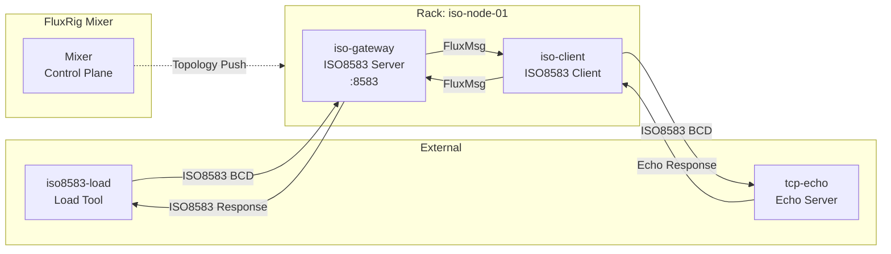
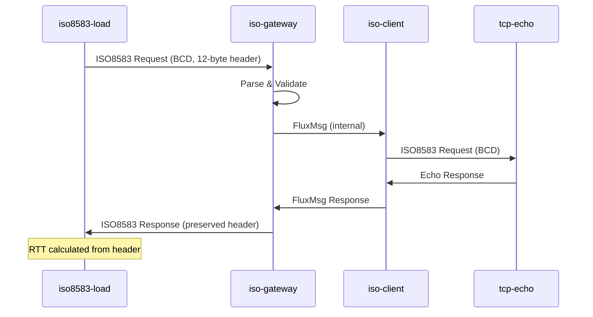
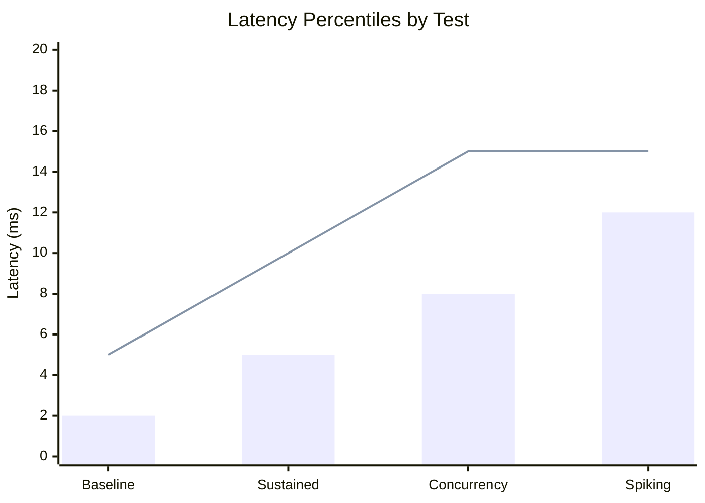
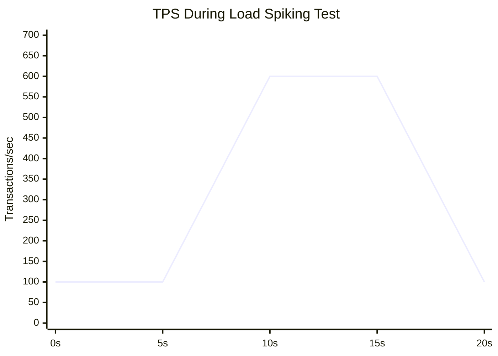
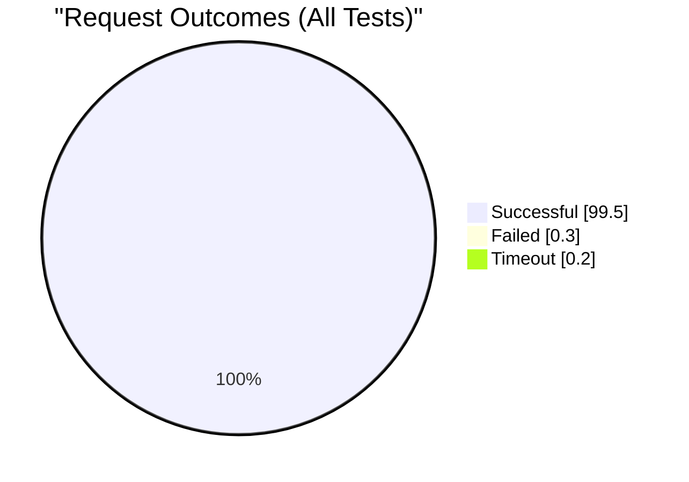
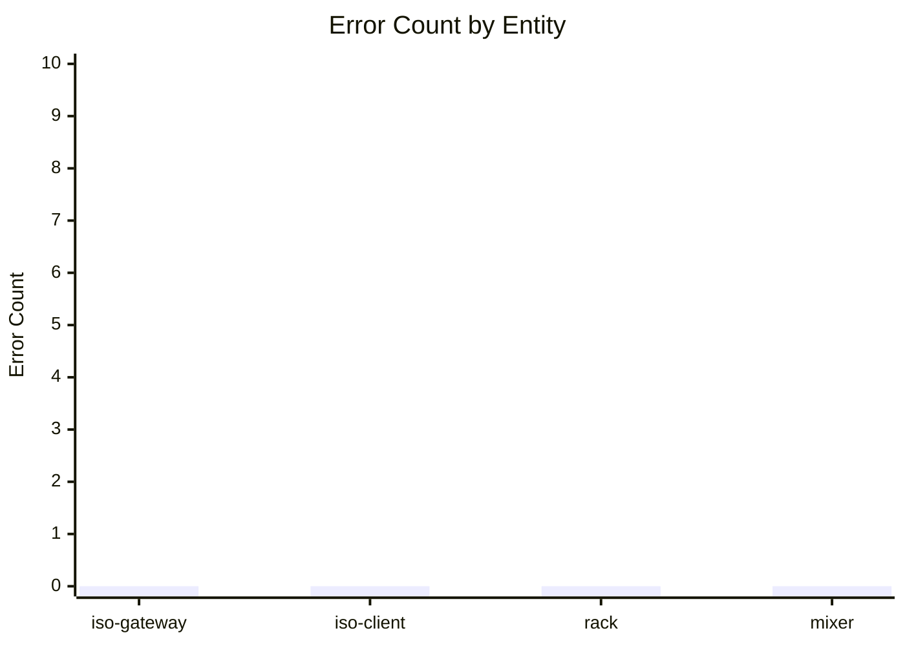
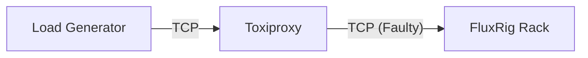

# ISO8583 Performance Test Suite

**Location**: `test/robot/suites/iso8583`

This suite validates the performance and reliability of the ISO8583 Gear under various load conditions, ensuring the FluxRig Mixer can handle realistic payment processing workloads.

## Architecture

The suite deploys a complete ISO8583 processing topology:



## Message Flow



## Components

| Component | Type | Port | Description |
|-----------|------|------|-------------|
| **Mixer** | Control Plane | 8090 | Manages topology, pushes scenarios |
| **iso-gateway** | ISO8583 Server Gear | 8583 | Accepts inbound ISO8583 connections |
| **iso-client** | ISO8583 Client Gear | N/A | Forwards to backend (Echo Server) |
| **tcp-echo** | Mock Backend | 8590 | Echoes received messages |
| **iso8583-load** | Load Generator | N/A | Generates ISO8583 traffic |

## Configuration

### Encoding
### Encoding & Framing
- **MTI/Fields**: BCD (Binary Coded Decimal) (`encoding: bcd`)
- **Framing**:
    - `frame_length_size`: 2 bytes
    - `frame_length_endian`: Big Endian
- **Protocol Header**:
    - `protocol_header_size`: 12 bytes (Timestamp header preserved for RTT)
    - `preserve_headers`: true

### Scenario File
`scenario_perf.yaml` defines:
- Rack deployment (`iso-node-01`)
- Gear configurations (server + client)
- Wire routing (bidirectional message flow)

## Test Cases

| Test | Concurrency | Rate | Duration | Success Threshold |
|------|-------------|------|----------|-------------------|
| **Baseline** | 5 | 10 TPS | 5s | 100% / P99 < 5ms |
| **Sustained Load** | 20 | 500 TPS | 30s | 99.9% / P99 < 10ms |
| **High Concurrency** | 100 | 200 TPS | 10s | 99% |
| **Load Spiking** | 20+50 | 100+500 TPS | 20s | Background: 99%, Spike: 95% |

### Validation Requirements

Each test case must validate:

1. **Log Error Check**: Scan `work/rack/logs/fluxrig.log` for `ERROR` level entries
2. **Parquet Error Check**: Query Mixer telemetry Parquet files for error logs
3. **Heuristic Pass Rate**: Verify `valid_heuristic=true` for all processed frames

## Metrics & Telemetry

### Load Tool Metrics (per test)

| Metric | Description | Source |
|--------|-------------|--------|
| `req_sent` | Total requests sent | `report.json` |
| `req_failed` | Failed requests (timeout/error) | `report.json` |
| `success_rate` | `(sent - failed) / sent * 100` | Calculated |
| `latency_p50_ms` | Median latency | `report.json` |
| `latency_p99_ms` | 99th percentile latency | `report.json` |
| `rtt_avg_ms` | Average round-trip time | `report.json` (if headers preserved) |

### Gear Telemetry (OTLP via NATS)

| Metric | Labels | Description |
|--------|--------|-------------|
| `fluxrig.gear.messages_in_total` | `gear`, `rack` | Messages received by Gear |
| `fluxrig.gear.messages_out_total` | `gear`, `rack` | Messages emitted by Gear |
| `fluxrig.gear.processing_duration_ms` | `gear` | Processing time histogram |
| `fluxrig.bus.publish_count` | `rack`, `subject` | Internal bus messages |

### Log Telemetry (Parquet)

Mixer persists logs to Parquet files in `work/mixer/data/telemetry/`:

| Column | Type | Description |
|--------|------|-------------|
| `timestamp` | TIMESTAMP | Log event time |
| `level` | STRING | `DEBUG`, `INFO`, `WARN`, `ERROR` |
| `entity_type` | STRING | `RACK`, `GEAR`, `MIXER` |
| `entity_name` | STRING | Component name (e.g., `iso-gateway`) |
| `message` | STRING | Log message |
| `attributes` | MAP | Structured log fields |

### Verification Queries

```sql
-- Count errors per entity
SELECT entity_name, COUNT(*) as error_count
FROM read_parquet('work/mixer/data/telemetry/*.parquet')
WHERE level = 'ERROR'
GROUP BY entity_name;

-- Verify no errors during test window
SELECT COUNT(*) as errors
FROM read_parquet('work/mixer/data/telemetry/*.parquet')
WHERE level = 'ERROR'
  AND timestamp BETWEEN '<test_start>' AND '<test_end>';
```

## Test Results Visualization

### Latency Distribution (Expected)



### Throughput Over Time (Load Spiking Test)



### Success Rate Summary



### Error Distribution by Component



### Metrics Dashboard

After each test run, the following visualizations are available in Robot's `log.html`:

| Chart | Description |
|-------|-------------|
| **Latency Histogram** | Distribution of response times |
| **TPS Timeline** | Requests per second over test duration |
| **Error Rate** | Percentage of failed requests |
| **P50/P99 Trend** | Latency percentiles across tests |


## Running

```bash
# Full suite
make test-robot-perf

# Or directly
./test/robot/run.sh test/robot/suites/iso8583/performance.robot
```

## Directory Structure

```
test/robot/suites/iso8583/
├── configs/
│   ├── mixer/
│   │   └── fluxrig-mixer.toml    # Mixer configuration
│   └── rack/
│       └── iso_rack.toml         # Rack configuration
├── performance.robot              # Test suite
├── scenario_perf.yaml            # Topology definition
├── work/ -> /tmp/...             # Symlink to runtime data
│   ├── mixer/
│   │   ├── data/                 # DuckDB, cluster.key
│   │   └── logs/                 # mixer.log
│   └── rack/
│       ├── data/                 # Rack state
│       └── logs/                 # fluxrig.log
└── README.md                     # This file
```

## Troubleshooting

### "No requests sent"
- Check that port 8583 is listening: `lsof -i :8583`
- Verify Rack logs for Gear startup: `cat work/rack/logs/fluxrig.log`

### "Connection refused"
- Ensure previous test runs are cleaned: `pkill -f fluxrig`
- Check Mixer health: `curl http://localhost:8090/healthz`

### Heuristic validation failures
- Verify encoding matches between load tool and Gear config
- Ensure `preserve_headers: true` is set for RTT header preservation

## 🛡️ Resilience Architecture

We use **Toxiproxy** to simulate network faults, ensuring FluxRig can recover from adverse conditions.

### 1. Server Resilience (Ingress Protection)
Validates that FluxRig (acting as a Server) handles unstable clients correctly.



*   **Test Cases**:
    *   **Slowloris**: Slow bandwidth from client (Attack prevention).
    *   **Connection Flapping**: Rapid connect/disconnect cycles.
    *   **Latency Spikes**: Client ACKs delayed by 500ms.

### 2. Client Resilience (Egress Reliability)
Validates that FluxRig (acting as a Client) handles unstable upstreams correctly.


*   **Test Cases**:
    *   **Connection Cut**: Upstream vanishes (RST/Timeout). Verify Auto-Reconnect.
    *   **Backpressure**: Upstream reads slowly. Verify internal queue/buffer management.
    *   **Brownout**: 50% Packet Loss. Verify Retry logic.

## 🛠️ Performance Tools

*   **`iso8583-load`**: High-performance ISO8583 traffic generator (Go).
*   **`tcp-echo`**: Minimalist upstream simulation/sink.
*   **`toxiproxy-cli`**: Fault injection controller.

