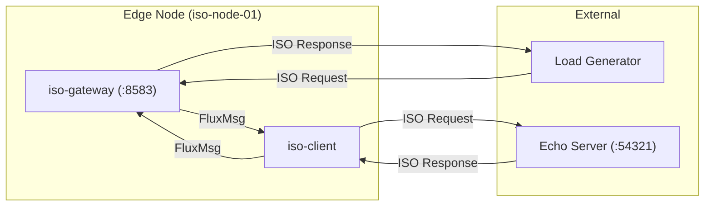
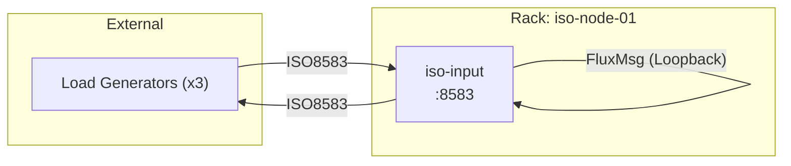
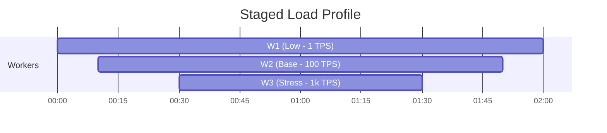
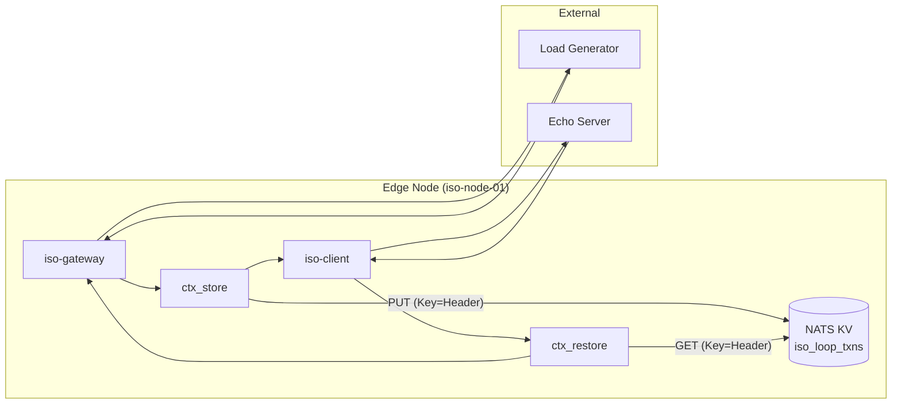

# ISO8583 Verification & Performance Suite

**Location**: `test/robot/suites/iso8583`

This suite contains the Robot Framework tests for verifying the **FluxRig ISO8583 Gear** and **Coat Check (Context Correlation)** patterns. It is designed to validate both functional correctness and high-throughput performance characteristics.

---

## 📂 Suite Composition

The suite is composed of two primary test definitions:

1.  **`performance.robot`**: The standard "Loopback" test.
    *   **Objective**: Validate raw packet processing speed, memory stability, and connection handling of the ISO8583 Gear.
    *   **Architecture**: `Load -> Gateway -> Client -> Echo`.
2.  **`coatcheck_loop.robot`**: The "Context Correlation" test.
    *   **Objective**: Validate that stateless request/response flows can correctly preserve metadata (Context) using the Coat Check pattern.
    *   **Architecture**: `Load -> Gateway -> Store -> Client -> Echo -> Restore -> Gateway`.

---

## 1. ISO8583 Performance Test (`performance.robot`)

This test focuses on the foundational `io_iso8583` gear. It stresses the input/output processing, framing, and encoding/decoding logic.

### Objectives
- **Zero Error Tolerance**: No dropped packets or log errors (ERROR/WARN) allowed during normal operation.
- **Latency Targets**: P99 Latency under 50ms at 100 TPS.
- **Memory Safety**: Verify no goroutine leaks or memory unbounded growth during sustained load.

### Topology
Standard "Hairpin" or Loopback topology:



---

## 2. Server Staged Load Test (`server_staged_load.robot`)

This test executes a complex load scenario with overlapping workers to simulate realistic traffic patterns.

### Objective
- **Sustained Load Stability**: Validate system behavior under varying concurrency levels.
- **Resource Usage**: Monitor memory/CPU during ramp-up and cool-down phases.
- **Worker Isolation**: Ensure multiple load generators don't interfere with each other.

### Topology
The Staged Load test uses an internal "Loopback" wire, meaning the Rack routes traffic from Input directly back to itself (echo), validating internal bus throughput.



### Load Schedule (Staged)
Overlapping workers create a "staircase" load profile to test system stability during ramp-up and ramp-down.



### Execution
Run this suite using the `staged` make target:

```bash
make test-robot-staged
```

## 3. Coat Check Validation (`coatcheck_loop.robot`)

This test validates the **Resilience and Correctness** of the asynchronous correlation mechanism (Coat Check).

### Objectives
- **Context Integrity**: Ensure 100% of responses are correctly matched with their original request context (Metadata).
- **Store/Restore Latency**: Measure the overhead introduced by the NATS KV operations (Store/Restore).
- **Concurrency**: Verify Key-Value store handles parallel R/W operations under load.

### Topology
The flow introduces "Store" and "Restore" steps to offload state before going to the upstream (Echo Server) and retrieve it upon return.



### Configuration Details (`configs/scenarios/scenario_coatcheck.yaml`)

*   **Correlation Key**: `meta.iso8583.raw_header`
    *   The `iso8583-tool` automatically injects a **timestamp** into the 12-byte header.
    *   This enables **Stateless RTT Calculation** (round-trip time) without server-side state.
    *   FluxRig uses this unique header as the **Correlation Key** for the Coat Check pattern.
*   **Storage**: NATS JetStream KV (`iso_loop_txns`).
*   **Missing Key Policy**: `error` (Test fails immediately if a response arrives with no matching request).

---

## 📊 Reports & Analysis

Both tests utilize the custom `FlowControlLibrary` to generate detailed HTML summary reports.

### Report Location
Artifacts are stored in `results/`, typically symlinked to Robot's output directory. Open `iso8583_performance_summary.html` (or `coatcheck_performance_summary.html`) for the dashboard.

### Key Metrics to Analyze

| Metric | Goal | Description |
| :--- | :--- | :--- |
| **Success Rate** | **100%** | (Requests Sent - Failed) / Sent. Any failure indicates a bug in flow or config. |
| **P99 Latency** | **< 50ms** | The 99th percentile end-to-end time. Spikes >100ms indicate contention. |
| **Throughput (TPS)** | **Target** | Check if the system hit the target TPS (1, 50, 200) defined in the Staged Load profile. |
| **Worker Skew** | **Low** | Ensure all parallel workers (W1, W2, etc.) achieved similar success rates. |

### Failure Analysis

If a test fails, check the following logs in `work/rack/logs/fluxrig.log`:

1.  **"coatcheck store: key extraction failed"**:
    *   **Cause**: The ISO8583 message didn't have the `raw_header` metadata.
    *   **Fix**: Check `preserve_headers: true` in `iso-gateway` config.

2.  **"coatcheck restore: key not found"**:
    *   **Cause**: The response header didn't match any stored key, or TTL expired.
    *   **Fix**: Verify Echo Server isn't mutating headers. Check if Latency > TTL (10s).

---

## 🚀 Running the Tests

We provide convenience `make` targets for all primary test suites.

| Suite | Command | Description |
| :--- | :--- | :--- |
| **Performance** | `make test-robot-iso` | Standard loopback performance test. |
| **Staged Load** | `make test-robot-staged` | Complex multi-worker load test. |
| **Coat Check** | `make test-robot-coatcheck` | Context correlation validation. |

Alternatively, you can run specific robot files directly:
```bash
./test/robot/run.sh test/robot/suites/iso8583/coatcheck_loop.robot
```
