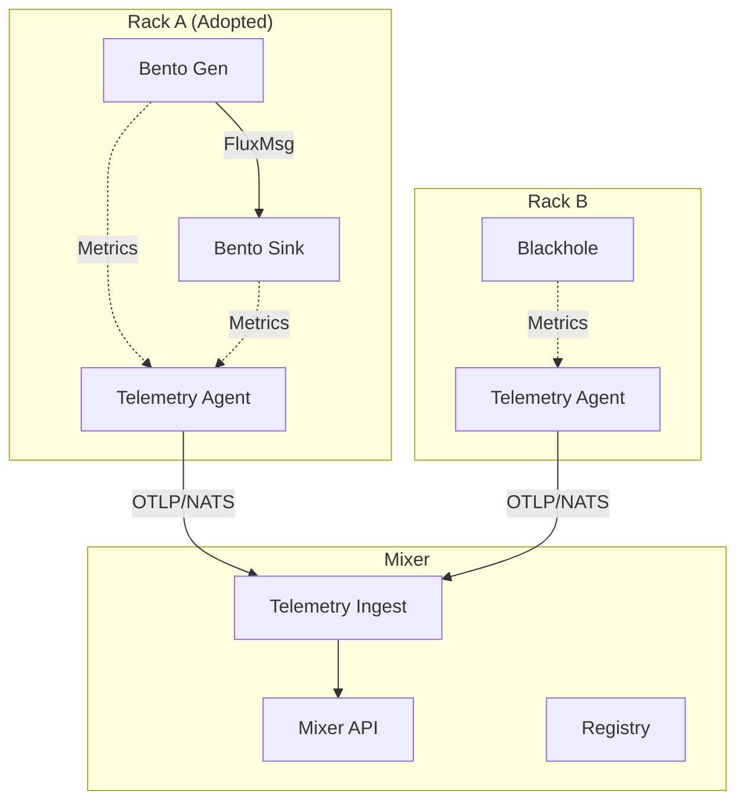

<!-- Copyright (c) 2025 JAAB Tech SAS, Uruguay All Rights Reserved -->
<!-- See https://jaab.tech -->

# Topology Verification Suite

**Location**: `test/robot/suites/topology`

This suite validates the core distributed capabilities of fluxrig, specifically verifying that Racks can associate with a Mixer, form a topology, exchange traffic, and reliably report telemetry.

## Scenarios

### 1. Cross-Rack Traffic (`cross_rack.robot`)
Validates a multi-rack setup with:
- **Mixer**: Central orchestration.
- **Rack A**: Traffic Generator (Bento).
- **Rack B**: Traffic Sink (Blackhole) + Telemetry Reporting.

**Key Validations**:
1.  **Topology Formation**: Verify Rack A and B appear in Mixer Registry.
2.  **Traffic Flow**: Messages sourced from Rack A arrive at Rack B's processor chain.
3.  **Telemetry Persistence**: Logs generated by Bento components are persisted to Parquet.
4.  **Metrics Reporting**: Validation of OTel metrics from Racks and Gears via Mixer API (`/api/v1/entity/{id}/stats`).
5.  **Log Parity**: Automated check that `wc -l` on physical log files matches Parquet entry counts (tolerance: 20%).

## Architecture



## Reporting

The suite generates an **Interactive Dashboard** in the Robot Framework Log (`log.html`). 

Look for the "Report Statistics" keyword output, which contains:
- **Registry Table**: Active Racks, Mixers, Gears, and Wires.
- **Log Statistics**: Bar chart of Logs per Entity Type.
- **Log Parity Table**: detailed comparison of physical vs reported logs.

## Running

```bash
# Run generic suite
./test/robot/run.sh test/robot/suites/topology/cross_rack.robot

# Or via Make
make robot
```

## Configuration

Configuration is loaded from:
- `configs/mixer/fluxrig-mixer.toml`
- `configs/rack/cattle.toml` (Rack A) - *Configured for 100ms telemetry flush*
- `configs/rack/rack_b.toml` (Rack B) - *Configured for 100ms telemetry flush*
- `scenarios/topology.yaml` (Bento Wiring)
